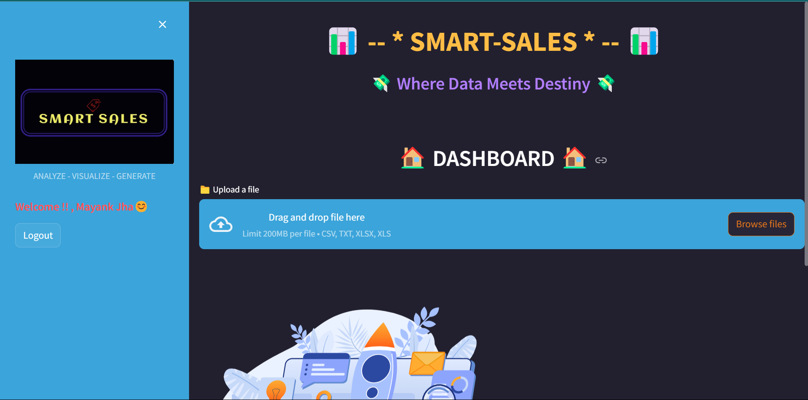

<h1>SMART-SALES - Your Gateway to Exploratory Sales Data !!💹</h1>

    Where innovation meets exploration in the world of sales data! Our cutting-edge Exploratory Sales Data Application is designed to revolutionize the way you analyze, understand, and leverage your sales data. Whether you're a seasoned sales professional or just starting your journey, SMART-SALES empowers you with the tools you need to make informed decisions and drive unprecedented success.

<h2>👇 Key Features 👇</h2>

    

        <h3>1. Intuitive Dashboard</h3>
        
Our user-friendly dashboard provides a real-time snapshot of your sales performance. Visualize key metrics, track trends, and gain insights at a glance. SMART-SALES ensures you are always in control, allowing you to make data-driven decisions effortlessly.

        
    

    

        <h3>2. Dynamic Data Exploration</h3>
        
Dive deep into your sales data with our powerful exploration tools. Uncover hidden patterns, identify opportunities, and understand customer behavior like never before. SMART-SALES puts the power of data exploration at your fingertips.

        
    

    

        <h3>3. Predictive Analytics</h3>
        
Stay ahead of the curve with our advanced predictive analytics. Anticipate market trends, forecast sales, and optimize your strategies for maximum impact. SMART-SALES doesn't just show you where you've been; it guides you to where you want to go.

        
    

<h2>🚀 Built With</h2>

    Our application was built using Python and the Streamlit environment, leveraging powerful machine learning and deep learning libraries like Pandas, Scikit-learn. For charts and visualizations, we utilized Plotly and Matplotlib.

<h2>🆕 Version 2.0 Update</h2>

    

        <h3>1. More Visually Appealing Charts and Graphs</h3>
        
We have introduced various visualizing figures to give precise analysis and make data interpretation easier and more intuitive.

    

    

        <h3>2. Advanced Machine Learning Algorithms</h3>
        
We have implemented new state-of-the-art machine learning and deep learning algorithms like KMeans, Linear Regression, Random Forest, XGBoost, etc., for clustering of data and creating prediction models.

    

    

        <h3>3. Predictive Suggestions</h3>
        
A new feature has been implemented where a ML model is trained to predict suggestions on the areas needing improvement based on the given analytics data, working as a predictor model.

    

    

        <h3>4. PDF Analytics Report</h3>
        
Generate a complete analytics report of all the analysis and visualizations made on the application in a PDF format with just one click.

    

<h3 class="center">🔗 Links</h3>
<h2> DEPLOYED LINK 📊 </h2>

    <a href="https://smart-sales-eda-application.streamlit.app/">👉Click Here 👈</a>

<h4> A Sample dataset is also uploaded with name as Superstore.csv for reference to test the application.</h4>

<h2> DEMONTRATION VIDEO 🎥 </h2>

 
    <a href="https://smart-sales-eda-application.streamlit.app/">👉Click Here 👈</a>

<footer>
    
This project is licensed under the MIT License - see the <a href="LICENSE">LICENSE</a> file for details.

    
If you have any questions, feel free to reach out via <a href="jhamayank043@gmail.com">Email</a>.

</footer>

</body>
</html>
